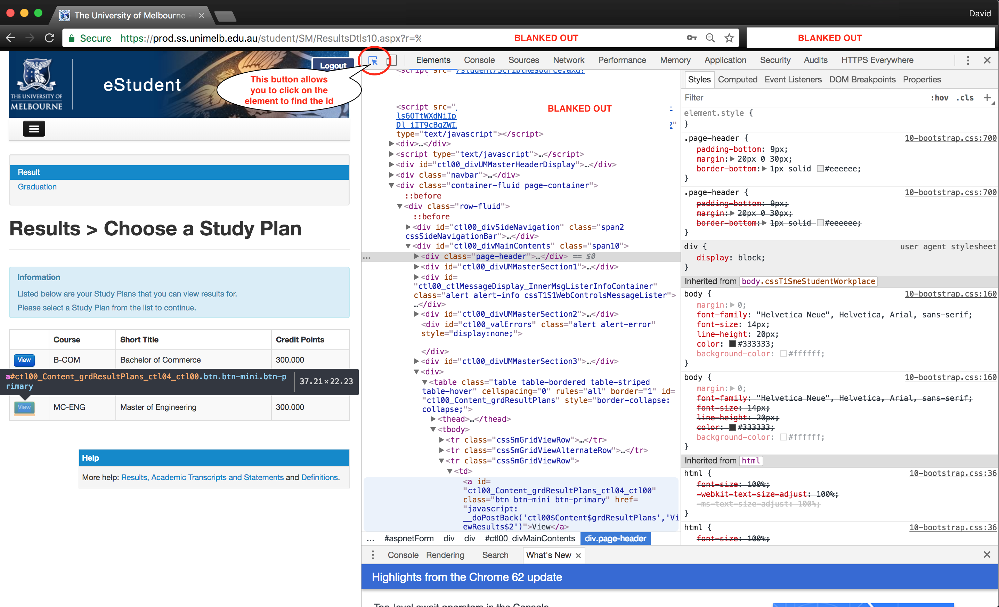

# MF Unimelb Results Checker
In the words of Matt Farrugia: "Periodically checks my.unimelb results page for new results and sends an email when new results are posted."

This README, and this program, contains [Matt Farrugia](https://github.com/matomatical)'s original work, and has been modified and updated by David Stern.

## Updates from DStern:
- This supports *only* multiple degree holders
- Emails results to self instead of a unimelb email address.
- Creates a 'status' file, to allow the user to view the date of last update.
- Retries click through (max 20 times) to wait for page load.
- Documented
- `system_test.py` provided to allow testing of libraries, phantomJS installation, creates a test email, and sends it.

## Dependencies
Requires python modules [Beautiful Soup](https://www.crummy.com/software/BeautifulSoup/), [html5lib](https://github.com/html5lib/), and [Selenium](http://docs.seleniumhq.org/). You can install these dependencies with [pip](https://pypi.python.org/pypi/pip) using `pip install -r path/to/repo/requirements.txt`.

Selenium requires headless browser [PhantomJS](http://phantomjs.org/) to be installed and on the path, so make sure `phantomjs` runs before you proceed.

Python 3.6 is required to run this program.

### Installing PhantomJS
One can either install `phantomjs` through npm (though Matt ran into some trouble using `apt install phantomjs`), or you can download the binary directly from the website linked above. 

In order to install phantomJS into the path of your terminal (where, in this example, the `phantomjs` binary is installed in `~/Downloads/phantomjs-2.1.1-macosx/bin`), open the `.bash_profile` or equivalent file and enter the lines (or equivalent): 

```
# ----------------------------------------------------------------------------
# Example: Setting PATH for phantomJS
export PATH="$HOME/Downloads/phantomjs-2.1.1-macosx/bin:$PATH"
# ----------------------------------------------------------------------------
```

Note that this example is specific to bash, and a 2.1.1 mac-osx version of the binary folder (the folder that contains phantomjs). You might, for example, place the phantomJS binary into your repository and change the path to the path of the repository. Note that the non-specific portions of this are (1) `export PATH="$HOME/`, and (2) `:$PATH"`

## File Setup
The results-checking script needs 3 files to be placed within the **results** directory: 
### (1) login.txt
**login.txt** should contain your student username on the first line, followed by your student password on the second line. An example **login.txt** file would be:
```
dstern
pAS5w0rd!1
```

### (2) **email.txt**
**email.txt** uses the same structure, but should contain the gmail username of the account you want to use to email the results, and its gmail password on the second line. An example **email.txt** file for the gmail address `results.robot@gmail.com` would be:

```
results.robot
pAS5w0rd!1
```

> Note: only the part of the email address before the `@gmail.com` is included in the file.

If you use 2-factor authentication, you can follow the [instructions here](https://support.google.com/accounts/answer/185833?hl=en) to generate a password for this application that you can use in **email.txt**.

### (3) **wam.txt**
**wam.txt** is a simple txt file containing only your current WAM on the first line, as it appears on the my.unimelb results page.


## Updating Specific Intermediate-page ID.
If you have multiple degrees, an intermediate page appears after login which requires a button to be found and clicked, to take you to the results page for your degree. In `main.py` on line 39, this is `ENG_BUTTON_ID` and is currently `"ctl00_Content_grdResultPlans_ctl04_ctl00"`. The screenshot below shows how this id can be found using Google Chrome.



## Running the Program
The following is an example of how one might run the program. To start, we change into the repository's directory, activate our python virtual environment, start the program (and create an output.txt file to store the output), and disown the process, so that the process may run in the background.

An example of this complete process is below:

```bash
> cd path/to/repo
> source ~/virtualenvs/new_env_name/bin/activate
(new_env_name) > bash run_results.sh > output.txt &
[1] 1392
(new_env_name) > disown 1392
```

## Stopping the Program after results release date
To stop the program we either take the noted process number from earlier (e.g. `1392`) or we use `ps -x` to find the `bash run_results.sh` process, and then kill it using, for example, `kill 1392`. Note that we DO NOT kill sleep 300, python, or any other programs. 

An example of this complete process is below:
```bash
(new_env_name) > ps -x
  PID TTY           TIME CMD
  386 ??         0:24.15 /usr/sbin/cfprefsd agent
  389 ??         0:14.06 /usr/libexec/UserEventAgent (Aqua)\
...
 1392 ttys000    0:00.03 bash run_results.sh
 2368 ttys000    0:00.00 sleep 300
 2369 ttys000    0:00.00 ps -x
(new_env_name) > kill 1392
```

## Setup Instructions With Python Virtual Environments
### Mac OSX/Unix Bash:
Stores virtual environments in ~/virtualenvs. Assumes Python 3.6 is already installed. You may check your python version using: `python -V`. The following is an example of a virtual-environments installation, with the environment name 'new_env_name'.

```bash
> cd ~
> mkdir virtualenvs
> cd path/to/repo
> python3.6 -m venv ~/virtualenvs/new_env_name --without-pip
> source ~/virtualenvs/new_env_name/bin/activate
(new_env_name) > wget https://bootstrap.pypa.io/get-pip.py
(new_env_name) > python get-pip.py
(new_env_name) > pip list
(new_env_name) > pip install -r requirements.txt
```

### Windows: 
TODO.

## Installation on a Cloud Server
Installing PhantomJS into a server without a GUI involved `wget`, `bzip2`, `tar` and `cp`. 
TODO: Proper explanation.
